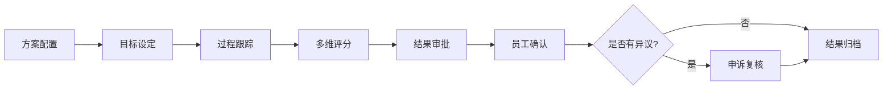

# 人事部门综合管理平台 - 产品需求文档

## 1. 产品概述

人事部门综合管理平台是一个覆盖员工从入职到退休全生命周期的综合管理系统，旨在解决传统人事工作中流程不透明、审批效率低、数据孤岛等问题。平台将招聘、人事、晋升、评审、绩效、考勤、离职、退休八大业务模块纳入统一系统，实现流程标准化、审批电子化、数据集中化。

**主要目的：**
- 将人事业务流程固化到系统中，消除人为随意性，保证业务合规
- 实现所有审批业务的电子化流转，支持多级审批、会签、加签等模式
- 建立统一的人员信息数据库，消除信息孤岛，支撑跨模块统计分析

**目标用户：**
- 人事部门工作人员（HR）
- 各部门负责人
- 分管领导
- 普通员工（自助服务）
- 系统管理员

## 2. 核心功能

### 2.1 用户角色

| 角色 | 核心权限 |
|------|----------|
| 系统管理员 | 全局配置、用户管理、权限分配 |
| 人事部门负责人 | 审批、统计、制度制定、全局人事数据查看 |
| 人事经办 | 日常操作、流程发起、基础数据维护 |
| 部门负责人 | 部门内审批、员工评价、部门数据查看 |
| 普通员工 | 自助查询、申请发起、个人信息维护 |
| 分管领导 | 高层审批、决策、全局数据查看 |
| 审计人员 | 日志查阅、合规检查 |

### 2.2 功能模块

1. **人员招聘模块**：用人需求申请、招聘计划与渠道管理、简历收集与筛选、面试管理、录用审批与 Offer
2. **人事管理模块**：员工档案管理、组织架构管理、岗位与编制管理、人员异动、合同管理
3. **职位晋升模块**：晋升计划发布、申报与推荐、资格审查、评审与审批、公示与任命
4. **干部评审模块**：评审方案制定、多维度评价（360度）、民主测评、个别谈话记录、评审结果与运用
5. **绩效考核模块**：考核方案配置、目标设定与分解、过程跟踪与记录、评分与汇总、结果确认与申诉
6. **出勤与假期模块**：考勤规则配置、日常考勤记录、假期管理、加班管理、考勤统计与报表
7. **离职手续模块**：离职申请与审批、离职面谈、工作交接、资产与权限回收、离职结算与证明
8. **退休退养模块**：退休预警与提醒、退休办理流程、内部退养管理、退休返聘管理、退休人员服务

### 2.3 页面详情

| 页面名称 | 模块名称 | 功能描述 |
|----------|----------|----------|
| 登录页 | 认证模块 | 用户登录、忘记密码、多因素认证入口 |
| 仪表盘 | 首页 | 待办事项、审批提醒、数据概览、快捷入口 |
| 招聘需求管理 | 人员招聘 | 用人需求申请列表、新建需求、需求审批跟踪 |
| 招聘计划管理 | 人员招聘 | 招聘计划列表、渠道管理、投递统计 |
| 简历管理 | 人员招聘 | 简历库、筛选、状态流转、面试安排 |
| 面试管理 | 人员招聘 | 面试安排、评价表填写、评分汇总 |
| 录用管理 | 人员招聘 | 录用审批、Offer 生成、入职待办 |
| 员工档案 | 人事管理 | 员工信息查看、编辑、档案查阅权限控制 |
| 组织架构 | 人事管理 | 树形组织结构展示、组织新增/撤销/合并/拆分 |
| 岗位编制 | 人事管理 | 岗位体系定义、编制数管理、超编/缺编监控 |
| 人员异动 | 人事管理 | 调岗、调级、借调、挂职申请与审批 |
| 合同管理 | 人事管理 | 合同签订/续签/变更/解除、到期提醒 |
| 晋升计划 | 职位晋升 | 晋升计划发布、条件设置、时间安排 |
| 晋升申报 | 职位晋升 | 个人申报、部门推荐、材料提交 |
| 晋升评审 | 职位晋升 | 资格审查、评审评议、审批公示 |
| 评审方案 | 干部评审 | 评审范围、维度权重、评审组成员、时间安排 |
| 多维度评价 | 干部评审 | 上级评价、同级互评、下级评议、自我评价 |
| 民主测评 | 干部评审 | 测评投票、等级评定、结果统计 |
| 评审结果 | 干部评审 | 综合报告生成、结果运用 |
| 考核方案 | 绩效考核 | 考核指标体系、权重配置、流程设置 |
| 目标管理 | 绩效考核 | 目标设定、分解、对齐、调整 |
| 考核评分 | 绩效考核 | 自评、上级评、跨部门评价、综合得分计算 |
| 考核结果 | 绩效考核 | 结果确认、申诉复核、归档 |
| 考勤规则 | 出勤与假期 | 上下班时间、打卡方式、加班规则配置 |
| 考勤记录 | 出勤与假期 | 打卡数据、异常标记、补卡申请 |
| 假期管理 | 出勤与假期 | 假期额度计算、请假申请、余额扣减 |
| 加班管理 | 出勤与假期 | 加班申请、时长记录、调休转换 |
| 考勤报表 | 出勤与假期 | 月度汇总、出勤天数、迟到次数、加班时长 |
| 离职申请 | 离职手续 | 离职申请、审批流程、离职原因记录 |
| 离职面谈 | 离职手续 | 面谈记录、员工反馈、归档保存 |
| 工作交接 | 离职手续 | 交接清单、事项确认、签字确认 |
| 资产回收 | 离职手续 | 资产归还清单、权限回收清单 |
| 离职结算 | 离职手续 | 薪资结算、离职证明生成 |
| 退休预警 | 退休退养 | 退休时间计算、预警提醒、待办生成 |
| 退休办理 | 退休退养 | 档案审核、待遇核算、工作交接、退休审批 |
| 退养管理 | 退休退养 | 退养申请、审批、待遇核算 |
| 退休返聘 | 退休退养 | 返聘申请、审批、协议签订 |
| 退休人员服务 | 退休退养 | 信息库维护、关怀活动组织 |
| 审批中心 | 工作流引擎 | 待审批事项、已审批事项、审批记录查询 |
| 流程配置 | 工作流引擎 | 可视化流程编辑器、节点配置、规则设置 |
| 角色权限 | 权限管理 | 角色定义、权限分配、数据权限设置 |
| 系统日志 | 权限管理 | 操作日志、审计日志、权限变更记录 |

## 3. 核心流程

### 3.1 招聘入职流程

员工从招聘需求提出到最终入职的完整流程：

1. 部门负责人提交用人需求申请
2. 需求经上级审批后生效
3. HR 制定招聘计划，选择发布渠道
4. 收集简历，按条件筛选
5. 安排多轮面试（笔试、初面、复面、终面）
6. 面试官填写评价表和评分
7. 确定录用人选，发起录用审批
8. 审批通过后生成录用通知书（Offer）
9. 候选人确认接受，触发入职待办
10. 人员信息流转至人事管理模块

### 3.2 晋升评审流程

员工职级晋升的完整流程：

1. 人事部门发布晋升计划
2. 个人申报或部门推荐
3. 提交述职报告和业绩材料
4. 人事部门资格审查
5. 通过审查的人员进入评审环节
6. 采取民主测评、述职答辩、评审委员会投票等方式
7. 评审结果汇总后进入审批流程
8. 审批通过后进行公示（5-7 个工作日）
9. 公示无异议后生成正式任命文件
10. 更新人员岗位和职级信息

### 3.3 绩效考核流程

定期绩效考核的完整流程：

1. 配置考核方案（指标体系、权重、评分标准）
2. 考核周期初设定目标
3. 周期内进行过程跟踪和记录
4. 考核期满后进行多维度评分
5. 系统按权重计算综合得分
6. 结果经审批后通知员工确认
7. 员工如有异议可发起申诉
8. 最终确认的考核结果归档

### 3.4 离职流程

员工离职的完整流程：

1. 员工提交离职申请或 HR 发起辞退流程
2. 进入审批流程：直接上级 → 部门负责人 → HR → 分管领导
3. HR 安排离职面谈
4. 离职员工填写工作交接清单
5. 系统生成资产归还清单和权限回收清单
6. 各责任人逐项确认完成
7. HR 核算薪资结算
8. 生成离职证明
9. 人员状态更新为"已离职"

## 4. 用户界面设计

### 4.1 设计风格

**色彩方案：**
- 主色调：深蓝色 #1B2A4A（专业、稳重）
- 强调色：蓝色 #2563EB（行动引导）
- 辅助色：青色 #0D9488（成功状态）
- 背景色：浅灰 #F5F7FA（清爽舒适）
- 危险色：红色 #DC2626（错误、警告）
- 警告色：橙色 #F59E0B（提醒）
- 成功色：绿色 #10B981（完成状态）

**字体方案：**
- 标题字体：Work Sans Bold（现代、清晰）
- 正文字体：PingFang SC / Microsoft YaHei（中文友好）
- 等宽字体：JetBrains Mono（代码、数据展示）

**按钮样式：**
- 主按钮：实心填充，圆角 6px，悬停时轻微上浮
- 次要按钮：描边样式，悬停时填充背景
- 危险按钮：红色填充，用于删除、驳回等操作
- 按钮高度：36px，内边距 16px

**布局风格：**
- 左侧导航栏：固定宽度 260px，深色背景
- 顶部工具栏：面包屑导航、用户信息、通知提醒
- 内容区域：卡片式布局，圆角 8px，轻微阴影
- 表格：固定表头，斑马纹，悬停高亮

**图标风格：**
- 使用 Lucide React 图标库
- 线条风格，2px 描边
- 与文字颜色保持一致

### 4.2 页面设计概览

| 页面名称 | 模块名称 | UI 元素 |
|----------|----------|---------|
| 登录页 | 认证模块 | 居中卡片布局，品牌 Logo，表单输入框，登录按钮，简洁背景 |
| 仪表盘 | 首页 | 数据卡片（待办数量、本月入职、离职等），待办列表，快捷入口网格，数据图表 |
| 招聘需求管理 | 人员招聘 | 表格列表，状态标签，筛选器，新建按钮，分页器 |
| 员工档案 | 人事管理 | 左侧树形组织架构，右侧员工列表，详情弹窗，标签页切换 |
| 组织架构 | 人事管理 | 树形图展示，节点可展开/折叠，右键菜单，拖拽排序 |
| 审批中心 | 工作流引擎 | 待审批/已审批/我发起的标签页，审批卡片，操作按钮，流程图展示 |
| 流程配置 | 工作流引擎 | 可视化流程编辑器，节点拖拽，连线配置，属性面板 |

### 4.3 响应式设计

**桌面端优先：**
- 最小宽度：1280px
- 推荐宽度：1440px - 1920px
- 左侧导航栏固定，内容区域自适应

**平板适配：**
- 宽度 768px - 1279px
- 左侧导航栏可折叠为图标模式
- 表格横向滚动，卡片单列布局

**移动端适配：**
- 宽度 < 768px
- 左侧导航栏隐藏，通过汉堡菜单唤出
- 卡片全宽布局，表格转为卡片式展示
- 触摸优化：按钮最小 44px，间距加大

### 4.4 交互设计

**加载状态：**
- 数据加载：骨架屏占位
- 按钮操作：加载动画，禁用重复点击
- 表单提交：按钮变为加载状态

**反馈机制：**
- 操作成功：顶部提示条，3 秒自动消失
- 操作失败：红色提示条，需手动关闭
- 确认操作：弹窗二次确认（删除、驳回等危险操作）

**空状态：**
- 列表为空：插画 + 提示文案 + 操作引导
- 搜索无结果：提示文案 + 清除筛选按钮

**错误处理：**
- 表单验证：实时校验，红色边框 + 错误提示
- 网络错误：重试按钮 + 错误详情
- 权限不足：友好提示 + 联系管理员
