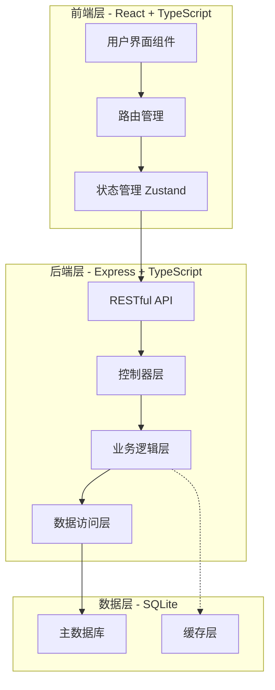
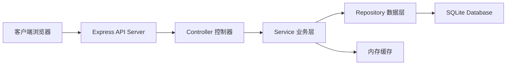
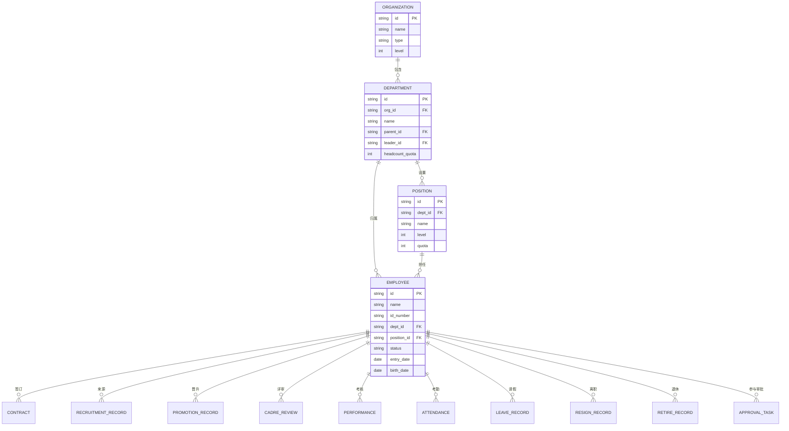

# 人事部门综合管理平台 - 技术架构文档

## 1. 架构设计

平台采用前后端分离的分层架构，前端负责用户交互，后端提供 API 服务，数据库存储业务数据。



## 2. 技术说明

- **前端**: React 18 + TypeScript + TailwindCSS 3 + Vite
- **初始化**: vite-init (react-ts 模板)
- **后端**: Express 4 + TypeScript
- **数据库**: SQLite (轻量级，便于部署和演示)
- **状态管理**: Zustand
- **路由**: React Router DOM
- **图标**: Lucide React

## 3. 路由定义

| 路由 | 用途 |
|------|------|
| /login | 登录页面 |
| /dashboard | 仪表盘首页 |
| /recruitment/demands | 招聘需求管理 |
| /recruitment/plans | 招聘计划管理 |
| /recruitment/resumes | 简历管理 |
| /recruitment/interviews | 面试管理 |
| /recruitment/offers | 录用管理 |
| /personnel/employees | 员工档案管理 |
| /personnel/organization | 组织架构管理 |
| /personnel/positions | 岗位编制管理 |
| /personnel/transfers | 人员异动管理 |
| /personnel/contracts | 合同管理 |
| /promotion/plans | 晋升计划管理 |
| /promotion/applications | 晋升申报管理 |
| /promotion/reviews | 晋升评审管理 |
| /cadre/plans | 评审方案管理 |
| /cadre/evaluations | 多维度评价 |
| /cadre/votes | 民主测评 |
| /cadre/results | 评审结果 |
| /performance/schemes | 考核方案管理 |
| /performance/goals | 目标管理 |
| /performance/scoring | 考核评分 |
| /performance/results | 考核结果 |
| /attendance/rules | 考勤规则配置 |
| /attendance/records | 考勤记录 |
| /attendance/leaves | 假期管理 |
| /attendance/overtime | 加班管理 |
| /attendance/reports | 考勤报表 |
| /resignation/applications | 离职申请 |
| /resignation/interviews | 离职面谈 |
| /resignation/handover | 工作交接 |
| /resignation/assets | 资产回收 |
| /resignation/settlement | 离职结算 |
| /retirement/warnings | 退休预警 |
| /retirement/processes | 退休办理 |
| /retirement/internal | 退养管理 |
| /retirement/reemployment | 退休返聘 |
| /retirement/services | 退休人员服务 |
| /workflow/approvals | 审批中心 |
| /workflow/config | 流程配置 |
| /system/roles | 角色权限管理 |
| /system/logs | 系统日志 |

## 4. API 定义

### 4.1 认证相关

```typescript
// 登录
POST /api/auth/login
Request: { username: string; password: string }
Response: { token: string; user: UserInfo }

// 登出
POST /api/auth/logout
Response: { success: boolean }

// 获取当前用户
GET /api/auth/me
Response: { user: UserInfo }
```

### 4.2 员工管理

```typescript
// 获取员工列表
GET /api/employees
Query: { page: number; size: number; keyword?: string; deptId?: string }
Response: { list: Employee[]; total: number }

// 获取员工详情
GET /api/employees/:id
Response: Employee

// 创建员工
POST /api/employees
Request: CreateEmployeeDTO
Response: Employee

// 更新员工
PUT /api/employees/:id
Request: UpdateEmployeeDTO
Response: Employee

// 删除员工
DELETE /api/employees/:id
Response: { success: boolean }
```

### 4.3 组织架构

```typescript
// 获取组织架构树
GET /api/organizations/tree
Response: OrganizationNode[]

// 创建部门
POST /api/departments
Request: CreateDepartmentDTO
Response: Department

// 更新部门
PUT /api/departments/:id
Request: UpdateDepartmentDTO
Response: Department

// 删除部门
DELETE /api/departments/:id
Response: { success: boolean }
```

### 4.4 审批流程

```typescript
// 获取待审批列表
GET /api/approvals/pending
Query: { page: number; size: number }
Response: { list: ApprovalTask[]; total: number }

// 获取已审批列表
GET /api/approvals/completed
Query: { page: number; size: number }
Response: { list: ApprovalTask[]; total: number }

// 审批通过
POST /api/approvals/:id/approve
Request: { comment?: string }
Response: { success: boolean }

// 审批驳回
POST /api/approvals/:id/reject
Request: { reason: string }
Response: { success: boolean }

// 发起审批
POST /api/approvals
Request: CreateApprovalDTO
Response: ApprovalTask
```

### 4.5 招聘管理

```typescript
// 获取招聘需求列表
GET /api/recruitment/demands
Query: { page: number; size: number; status?: string }
Response: { list: RecruitmentDemand[]; total: number }

// 创建招聘需求
POST /api/recruitment/demands
Request: CreateRecruitmentDemandDTO
Response: RecruitmentDemand

// 获取简历列表
GET /api/recruitment/resumes
Query: { page: number; size: number; status?: string }
Response: { list: Resume[]; total: number }

// 创建面试安排
POST /api/recruitment/interviews
Request: CreateInterviewDTO
Response: Interview
```

### 4.6 考勤管理

```typescript
// 获取考勤记录
GET /api/attendance/records
Query: { employeeId: string; startDate: string; endDate: string }
Response: AttendanceRecord[]

// 提交请假申请
POST /api/attendance/leaves
Request: CreateLeaveDTO
Response: LeaveRecord

// 获取假期余额
GET /api/attendance/leaves/balance
Query: { employeeId: string; year: number }
Response: LeaveBalance
```

## 5. 服务器架构图



## 6. 数据模型

### 6.1 数据模型定义



### 6.2 数据定义语言

```sql
-- 组织表
CREATE TABLE organization (
    id TEXT PRIMARY KEY,
    name TEXT NOT NULL,
    type TEXT NOT NULL,
    level INTEGER DEFAULT 1,
    created_at DATETIME DEFAULT CURRENT_TIMESTAMP,
    updated_at DATETIME DEFAULT CURRENT_TIMESTAMP
);

-- 部门表
CREATE TABLE department (
    id TEXT PRIMARY KEY,
    org_id TEXT NOT NULL,
    name TEXT NOT NULL,
    parent_id TEXT,
    leader_id TEXT,
    headcount_quota INTEGER DEFAULT 0,
    created_at DATETIME DEFAULT CURRENT_TIMESTAMP,
    updated_at DATETIME DEFAULT CURRENT_TIMESTAMP,
    FOREIGN KEY (org_id) REFERENCES organization(id),
    FOREIGN KEY (parent_id) REFERENCES department(id)
);

-- 岗位表
CREATE TABLE position (
    id TEXT PRIMARY KEY,
    dept_id TEXT NOT NULL,
    name TEXT NOT NULL,
    level INTEGER DEFAULT 1,
    quota INTEGER DEFAULT 0,
    created_at DATETIME DEFAULT CURRENT_TIMESTAMP,
    updated_at DATETIME DEFAULT CURRENT_TIMESTAMP,
    FOREIGN KEY (dept_id) REFERENCES department(id)
);

-- 员工表
CREATE TABLE employee (
    id TEXT PRIMARY KEY,
    name TEXT NOT NULL,
    id_number TEXT UNIQUE NOT NULL,
    dept_id TEXT NOT NULL,
    position_id TEXT,
    status TEXT DEFAULT 'active',
    entry_date DATE,
    birth_date DATE,
    phone TEXT,
    email TEXT,
    created_at DATETIME DEFAULT CURRENT_TIMESTAMP,
    updated_at DATETIME DEFAULT CURRENT_TIMESTAMP,
    FOREIGN KEY (dept_id) REFERENCES department(id),
    FOREIGN KEY (position_id) REFERENCES position(id)
);

-- 合同表
CREATE TABLE contract (
    id TEXT PRIMARY KEY,
    employee_id TEXT NOT NULL,
    contract_no TEXT UNIQUE NOT NULL,
    start_date DATE NOT NULL,
    end_date DATE NOT NULL,
    status TEXT DEFAULT 'active',
    created_at DATETIME DEFAULT CURRENT_TIMESTAMP,
    updated_at DATETIME DEFAULT CURRENT_TIMESTAMP,
    FOREIGN KEY (employee_id) REFERENCES employee(id)
);

-- 招聘需求表
CREATE TABLE recruitment_demand (
    id TEXT PRIMARY KEY,
    dept_id TEXT NOT NULL,
    position_name TEXT NOT NULL,
    headcount INTEGER NOT NULL,
    requirements TEXT,
    status TEXT DEFAULT 'pending',
    created_by TEXT,
    created_at DATETIME DEFAULT CURRENT_TIMESTAMP,
    updated_at DATETIME DEFAULT CURRENT_TIMESTAMP,
    FOREIGN KEY (dept_id) REFERENCES department(id)
);

-- 简历表
CREATE TABLE resume (
    id TEXT PRIMARY KEY,
    demand_id TEXT,
    name TEXT NOT NULL,
    phone TEXT,
    email TEXT,
    education TEXT,
    experience_years INTEGER,
    status TEXT DEFAULT 'screening',
    created_at DATETIME DEFAULT CURRENT_TIMESTAMP,
    updated_at DATETIME DEFAULT CURRENT_TIMESTAMP,
    FOREIGN KEY (demand_id) REFERENCES recruitment_demand(id)
);

-- 面试表
CREATE TABLE interview (
    id TEXT PRIMARY KEY,
    resume_id TEXT NOT NULL,
    interview_date DATETIME NOT NULL,
    interview_type TEXT NOT NULL,
    interviewer_id TEXT,
    score INTEGER,
    comment TEXT,
    status TEXT DEFAULT 'scheduled',
    created_at DATETIME DEFAULT CURRENT_TIMESTAMP,
    updated_at DATETIME DEFAULT CURRENT_TIMESTAMP,
    FOREIGN KEY (resume_id) REFERENCES resume(id),
    FOREIGN KEY (interviewer_id) REFERENCES employee(id)
);

-- 晋升记录表
CREATE TABLE promotion_record (
    id TEXT PRIMARY KEY,
    employee_id TEXT NOT NULL,
    from_position_id TEXT,
    to_position_id TEXT,
    promotion_date DATE,
    status TEXT DEFAULT 'pending',
    created_at DATETIME DEFAULT CURRENT_TIMESTAMP,
    updated_at DATETIME DEFAULT CURRENT_TIMESTAMP,
    FOREIGN KEY (employee_id) REFERENCES employee(id)
);

-- 干部评审表
CREATE TABLE cadre_review (
    id TEXT PRIMARY KEY,
    employee_id TEXT NOT NULL,
    review_period TEXT NOT NULL,
    review_dimension TEXT NOT NULL,
    score INTEGER,
    comment TEXT,
    reviewer_id TEXT,
    created_at DATETIME DEFAULT CURRENT_TIMESTAMP,
    FOREIGN KEY (employee_id) REFERENCES employee(id),
    FOREIGN KEY (reviewer_id) REFERENCES employee(id)
);

-- 绩效考核表
CREATE TABLE performance (
    id TEXT PRIMARY KEY,
    employee_id TEXT NOT NULL,
    period TEXT NOT NULL,
    goal TEXT,
    score INTEGER,
    level TEXT,
    status TEXT DEFAULT 'pending',
    created_at DATETIME DEFAULT CURRENT_TIMESTAMP,
    updated_at DATETIME DEFAULT CURRENT_TIMESTAMP,
    FOREIGN KEY (employee_id) REFERENCES employee(id)
);

-- 考勤记录表
CREATE TABLE attendance (
    id TEXT PRIMARY KEY,
    employee_id TEXT NOT NULL,
    date DATE NOT NULL,
    check_in DATETIME,
    check_out DATETIME,
    status TEXT DEFAULT 'normal',
    created_at DATETIME DEFAULT CURRENT_TIMESTAMP,
    FOREIGN KEY (employee_id) REFERENCES employee(id)
);

-- 请假记录表
CREATE TABLE leave_record (
    id TEXT PRIMARY KEY,
    employee_id TEXT NOT NULL,
    leave_type TEXT NOT NULL,
    start_date DATE NOT NULL,
    end_date DATE NOT NULL,
    days INTEGER NOT NULL,
    reason TEXT,
    status TEXT DEFAULT 'pending',
    created_at DATETIME DEFAULT CURRENT_TIMESTAMP,
    updated_at DATETIME DEFAULT CURRENT_TIMESTAMP,
    FOREIGN KEY (employee_id) REFERENCES employee(id)
);

-- 离职记录表
CREATE TABLE resign_record (
    id TEXT PRIMARY KEY,
    employee_id TEXT NOT NULL,
    resign_date DATE NOT NULL,
    resign_type TEXT NOT NULL,
    reason TEXT,
    status TEXT DEFAULT 'pending',
    created_at DATETIME DEFAULT CURRENT_TIMESTAMP,
    updated_at DATETIME DEFAULT CURRENT_TIMESTAMP,
    FOREIGN KEY (employee_id) REFERENCES employee(id)
);

-- 退休记录表
CREATE TABLE retire_record (
    id TEXT PRIMARY KEY,
    employee_id TEXT NOT NULL,
    retire_date DATE NOT NULL,
    retire_type TEXT NOT NULL,
    status TEXT DEFAULT 'pending',
    created_at DATETIME DEFAULT CURRENT_TIMESTAMP,
    updated_at DATETIME DEFAULT CURRENT_TIMESTAMP,
    FOREIGN KEY (employee_id) REFERENCES employee(id)
);

-- 审批任务表
CREATE TABLE approval_task (
    id TEXT PRIMARY KEY,
    business_type TEXT NOT NULL,
    business_id TEXT NOT NULL,
    title TEXT NOT NULL,
    applicant_id TEXT NOT NULL,
    approver_id TEXT,
    status TEXT DEFAULT 'pending',
    comment TEXT,
    created_at DATETIME DEFAULT CURRENT_TIMESTAMP,
    updated_at DATETIME DEFAULT CURRENT_TIMESTAMP,
    FOREIGN KEY (applicant_id) REFERENCES employee(id),
    FOREIGN KEY (approver_id) REFERENCES employee(id)
);

-- 用户表
CREATE TABLE user (
    id TEXT PRIMARY KEY,
    username TEXT UNIQUE NOT NULL,
    password TEXT NOT NULL,
    employee_id TEXT,
    role TEXT DEFAULT 'employee',
    created_at DATETIME DEFAULT CURRENT_TIMESTAMP,
    updated_at DATETIME DEFAULT CURRENT_TIMESTAMP,
    FOREIGN KEY (employee_id) REFERENCES employee(id)
);

-- 创建索引
CREATE INDEX idx_employee_dept ON employee(dept_id);
CREATE INDEX idx_employee_status ON employee(status);
CREATE INDEX idx_attendance_employee ON attendance(employee_id);
CREATE INDEX idx_attendance_date ON attendance(date);
CREATE INDEX idx_approval_applicant ON approval_task(applicant_id);
CREATE INDEX idx_approval_approver ON approval_task(approver_id);
CREATE INDEX idx_approval_status ON approval_task(status);

-- 插入初始数据
INSERT INTO organization (id, name, type, level) VALUES ('org-001', '示例公司', 'enterprise', 1);

INSERT INTO department (id, org_id, name, parent_id, leader_id, headcount_quota) VALUES 
('dept-001', 'org-001', '人事部', NULL, NULL, 20),
('dept-002', 'org-001', '技术部', NULL, NULL, 50),
('dept-003', 'org-001', '市场部', NULL, NULL, 30);

INSERT INTO position (id, dept_id, name, level, quota) VALUES 
('pos-001', 'dept-001', '人事经理', 5, 1),
('pos-002', 'dept-001', '人事专员', 3, 5),
('pos-003', 'dept-002', '技术总监', 7, 1),
('pos-004', 'dept-002', '高级工程师', 5, 10),
('pos-005', 'dept-003', '市场经理', 5, 1);

INSERT INTO employee (id, name, id_number, dept_id, position_id, status, entry_date, birth_date, phone, email) VALUES 
('emp-001', '张三', '110101199001011234', 'dept-001', 'pos-001', 'active', '2020-01-01', '1990-01-01', '13800138000', 'zhangsan@example.com'),
('emp-002', '李四', '110101199201011234', 'dept-002', 'pos-003', 'active', '2019-03-15', '1992-01-01', '13800138001', 'lisi@example.com'),
('emp-003', '王五', '110101199301011234', 'dept-003', 'pos-005', 'active', '2021-06-01', '1993-01-01', '13800138002', 'wangwu@example.com');

INSERT INTO user (id, username, password, employee_id, role) VALUES 
('user-001', 'admin', 'admin123', 'emp-001', 'admin'),
('user-002', 'hr', 'hr123', 'emp-001', 'hr_manager'),
('user-003', 'tech', 'tech123', 'emp-002', 'dept_head'),
('user-004', 'market', 'market123', 'emp-003', 'dept_head');
```
